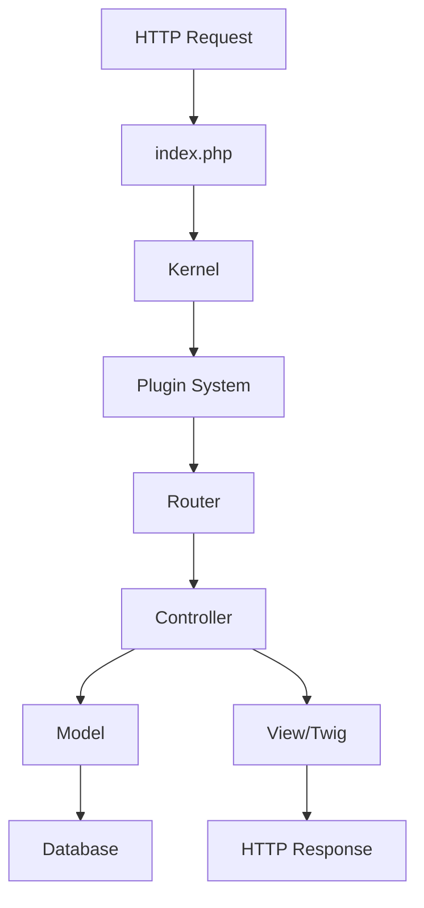
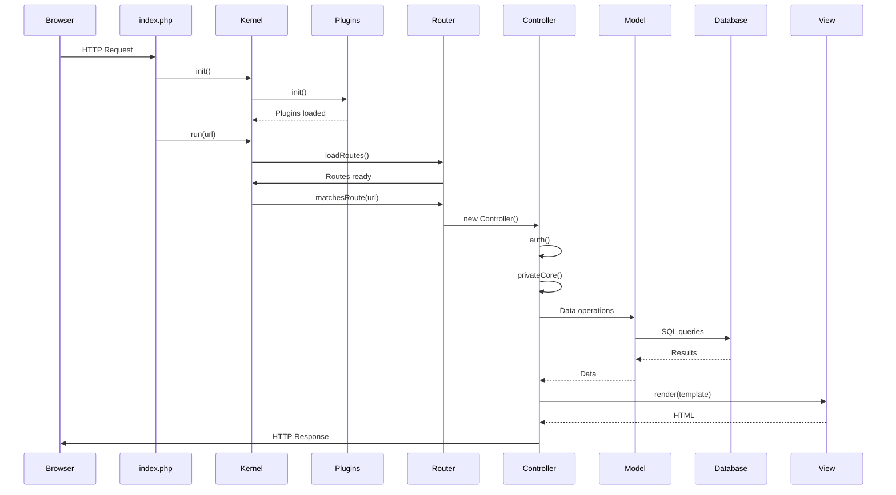

## Architectural Overview

FacturaScripts follows a **Model-View-Controller (MVC)** pattern with a **plugin-based architecture**. The framework is designed for extensibility, allowing developers to add functionality without modifying core code.

### High-Level Architecture



## The Kernel: Heart of FacturaScripts

The `Kernel` class (`Core/Kernel.php`) is the central component that manages the application lifecycle.

### Kernel Responsibilities

<CardGroup cols={2}>
  <Card title="Initialization" icon="power-off">
    Sets up constants, language settings, and system configuration during `Kernel::init()`.
  </Card>
  <Card title="Routing" icon="route">
    Manages URL-to-controller mapping with `addRoute()`, `rebuildRoutes()`, and route matching.
  </Card>
  <Card title="Request Handling" icon="arrows-left-right">
    Executes the appropriate controller via `Kernel::run()` and handles exceptions.
  </Card>
  <Card title="Performance Monitoring" icon="stopwatch">
    Tracks execution time with `startTimer()` and `stopTimer()` for performance analysis.
  </Card>
</CardGroup>

### Kernel Initialization

Location: `Core/Kernel.php:95-135`

```php
public static function init(): void
{
    self::startTimer('kernel::init');
    
    // Load configuration constants for backward compatibility
    $constants = [
        'FS_CODPAIS' => ['property' => 'codpais', 'default' => $initial_codpais],
        'FS_CURRENCY_POS' => ['property' => 'currency_position', 'default' => 'right'],
        'FS_ITEM_LIMIT' => ['property' => 'item_limit', 'default' => 50],
        // ...
    ];
    
    // Set language from cookie or default
    $lang = $_COOKIE['fsLang'] ?? Tools::config('lang', 'es_ES');
    Translator::setDefaultLang($lang);
    
    // Register work queue workers
    WorkQueue::addWorker('CuentaWorker', 'Model.Cuenta.Delete');
    // ...
    
    self::stopTimer('kernel::init');
}
```

### Routing System

The Kernel maintains a route registry that maps URLs to controllers.

#### Route Types

| Pattern | Example | Description |
|---------|---------|-------------|
| Exact | `/login` | Matches exact URL |
| Wildcard | `/Core/Assets/*` | Matches URL prefix |
| Dynamic | `/EditCliente` | Auto-generated from controllers |
| API | `/api/3/productos` | RESTful API endpoints |

#### Route Registration

Location: `Core/Kernel.php:43-60`

```php
public static function addRoute(string $route, string $controller, 
                                int $position = 0, string $customId = ''): void
{
    // Remove existing route if customId matches
    if (!empty($customId)) {
        foreach (self::$routes as $key => $value) {
            if ($value['customId'] === $customId) {
                unset(self::$routes[$key]);
            }
        }
    }
    
    // Add new route with priority position
    self::$routes[$route] = [
        'controller' => $controller,
        'customId' => $customId,
        'position' => $position,
    ];
}
```

#### Route Rebuilding

Location: `Core/Kernel.php:152-188`

When plugins are enabled/disabled, routes are rebuilt:

```php
public static function rebuildRoutes(): void
{
    self::$routes = [];
    self::loadDefaultRoutes();
    
    // Load default homepage
    $homePage = Tools::settings('default', 'homepage', 'Root');
    
    // Scan Dinamic/Controller directory
    $dir = Tools::folder('Dinamic', 'Controller');
    foreach (Tools::folderScan($dir) as $file) {
        if ('.php' !== substr($file, -4)) continue;
        
        $route = substr($file, 0, -4);
        $controller = '\\FacturaScripts\\Dinamic\\Controller\\' . $route;
        self::addRoute('/' . $route, $controller);
        
        // Set homepage as root
        if ($route === $homePage) {
            self::addRoute('/', $controller);
        }
    }
    
    // Execute callbacks for custom routes
    foreach (self::$routesCallbacks as $callback) {
        $callback(self::$routes);
    }
    
    // Sort by position (lower = higher priority)
    uasort(self::$routes, fn($a, $b) => $a['position'] <=> $b['position']);
}
```

### Request Execution

Location: `Core/Kernel.php:190-208`

```php
public static function run(string $url): void
{
    Kernel::startTimer('kernel::run');
    $relativeUrl = self::getRelativeUrl($url);
    
    try {
        self::loadRoutes();
        self::runController($relativeUrl);
        self::finishRequest();
    } catch (Exception $exception) {
        error_clear_last();
        $handler = self::getErrorHandler($exception);
        $handler->run();
    }
    
    Kernel::stopTimer('kernel::run');
}
```

## MVC Pattern Implementation

### Controllers: Request Handlers

Location: `Core/Base/Controller.php`

All controllers inherit from the base `Controller` class.

#### Controller Structure

```php
namespace FacturaScripts\Core\Base;

class Controller implements ControllerInterface
{
    protected $dataBase;        // Database access
    public $empresa;            // Current company
    public $permissions;        // User permissions
    public $request;            // HTTP request
    protected $response;        // HTTP response
    public $user;               // Logged-in user
    public $title;              // Page title
    private $template;          // Twig template
    public $uri;                // Current URI
}
```

#### Controller Lifecycle

Location: `Core/Base/Controller.php:282-323`

```php
public function run(): void
{
    $response = new Response();
    
    // Authenticate user
    if ($this->auth()) {
        // Private area - user is logged in
        $permissions = new ControllerPermissions(Session::user(), $this->className);
        $this->privateCore($response, Session::user(), $permissions);
        
        // Render template
        if ($this->template) {
            Kernel::startTimer('Controller::html-render');
            $response->view($this->template, [
                'controllerName' => $this->className,
                'fsc' => $this,
                'menuManager' => NewMenuManager::init()->selectPage($this->getPageData()),
                'template' => $this->template,
            ]);
            Kernel::stopTimer('Controller::html-render');
        }
        
        $response->send();
        return;
    }
    
    // Public area - not authenticated
    $this->publicCore($response);
    
    if ($this->template) {
        $response->view($this->template, [...]);
    }
    
    $response->send();
}
```

#### Authentication Flow

Location: `Core/Base/Controller.php:348-394`

```php
private function auth(): bool
{
    // Get user nick from cookie
    $cookieNick = $this->request->cookie('fsNick', '');
    if (empty($cookieNick)) {
        return false;
    }
    
    // Load user from database
    $user = new DinUser();
    if (false === $user->load($cookieNick)) {
        Tools::log()->warning('login-user-not-found');
        return false;
    }
    
    // Check if user is enabled
    if (false === $user->enabled) {
        Tools::log()->warning('login-user-disabled');
        setcookie('fsNick', '', $cookiesExpire, Tools::config('route', '/'));
        return false;
    }
    
    // Verify logkey (session token)
    $logKey = $this->request->cookie('fsLogkey', '') ?? '';
    if (false === $user->verifyLogkey($logKey)) {
        Tools::log()->warning('login-cookie-fail');
        return false;
    }
    
    // Update last activity
    if (time() - strtotime($user->lastactivity) > User::UPDATE_ACTIVITY_PERIOD) {
        $ip = Session::getClientIp();
        $browser = $this->request->header('User-Agent');
        $user->updateActivity($ip, $browser);
        $user->save();
    }
    
    Session::set('user', $user);
    return true;
}
```

### Models: Data Layer

Location: `Core/Model/Base/ModelClass.php`

Models represent database tables and business entities.

#### Model Structure

```php
abstract class ModelClass extends ModelCore
{
    // Static methods
    public static function all(array $where, array $order, int $offset, int $limit);
    public static function tableName(): string;
    public static function primaryColumn(): string;
    
    // Instance methods
    public function save(): bool;
    public function delete(): bool;
    public function exists(): bool;
    public function test(): bool;
    public function loadFromCode($code): bool;
    public function get($code);
    
    // Query methods
    public function count(array $where): int;
    public function newCode(string $field, array $where);
}
```

#### CRUD Operations

**Create/Update:**

Location: `Core/Model/Base/ModelClass.php:275-297`

```php
public function save(): bool
{
    if ($this->pipeFalse('saveBefore') === false) {
        return false;
    }
    
    if (false === $this->test()) {
        return false;
    }
    
    $done = $this->exists() ? $this->saveUpdate() : $this->saveInsert();
    if (false === $done) {
        return false;
    }
    
    // Send to work queue for async processing
    WorkQueue::send(
        'Model.' . $this->modelClassName() . '.Save',
        $this->primaryColumnValue(),
        $this->toArray()
    );
    
    return $this->pipeFalse('save');
}
```

**Delete:**

Location: `Core/Model/Base/ModelClass.php:134-162`

```php
public function delete(): bool
{
    if (null === $this->primaryColumnValue()) {
        return true;
    }
    
    if ($this->pipeFalse('deleteBefore') === false) {
        return false;
    }
    
    $sql = 'DELETE FROM ' . static::tableName() . ' WHERE ' . static::primaryColumn()
        . ' = ' . self::$dataBase->var2str($this->primaryColumnValue()) . ';';
    
    if (false === self::$dataBase->exec($sql)) {
        return false;
    }
    
    // Clear caches
    Cache::deleteMulti('model-' . $this->modelClassName() . '-');
    Cache::deleteMulti('join-model-');
    Cache::deleteMulti('table-' . static::tableName() . '-');
    
    return $this->pipeFalse('delete');
}
```

### Database Layer

Location: `Core/Base/DataBase.php`

The `DataBase` class provides abstraction for MySQL and PostgreSQL.

#### Database Features

<CardGroup cols={2}>
  <Card title="Connection Management" icon="plug">
    Singleton pattern with `connect()`, `close()`, and connection state tracking.
  </Card>
  <Card title="Query Execution" icon="play">
    `exec()` for INSERT/UPDATE/DELETE, `select()` and `selectLimit()` for queries.
  </Card>
  <Card title="Transactions" icon="code-branch">
    `beginTransaction()`, `commit()`, and `rollback()` for ACID operations.
  </Card>
  <Card title="Schema Management" icon="table">
    `getColumns()`, `getIndexes()`, `getConstraints()` for structure introspection.
  </Card>
</CardGroup>

#### Connection

Location: `Core/Base/DataBase.php:76-92`

```php
public function __construct()
{
    if (Tools::config('db_name') && self::$link === null) {
        self::$miniLog = new MiniLog(self::CHANNEL);
        
        self::$type = strtolower(Tools::config('db_type'));
        switch (self::$type) {
            case 'postgresql':
                self::$engine = new PostgresqlEngine();
                break;
            default:
                self::$engine = new MysqlEngine();
                break;
        }
    }
}
```

#### Query Execution

Location: `Core/Base/DataBase.php:226-263`

```php
public function exec(string $sql): bool
{
    $result = $this->connected();
    if ($result) {
        // Clear table cache
        self::$tables = [];
        
        $inTransaction = $this->inTransaction();
        $this->beginTransaction();
        
        // Execute SQL
        $start = microtime(true);
        $result = self::$engine->exec(self::$link, $sql);
        $stop = microtime(true);
        
        // Log query
        self::$miniLog->debug($sql, ['duration' => $stop - $start]);
        
        // Check for errors
        if (!$result || self::$engine->hasError()) {
            self::$miniLog->error(self::$engine->errorMessage(self::$link), ['sql' => $sql]);
            self::$engine->clearError();
        }
        
        if ($inTransaction) {
            return $result;
        }
        
        // Auto-commit or rollback
        if ($result) {
            return $this->commit();
        }
        
        $this->rollback();
    }
    
    return $result;
}
```

### Views: Presentation Layer

FacturaScripts uses **Twig** template engine for views.

#### Template Location

Templates are located in:
- `Core/View/` - Core templates
- `Plugins/{PluginName}/View/` - Plugin templates
- `Dinamic/View/` - Merged templates

#### Template Variables

Controllers pass variables to templates:

```php
$response->view($this->template, [
    'controllerName' => $this->className,
    'fsc' => $this,  // Controller instance
    'menuManager' => $menuManager,
    'template' => $this->template,
]);
```

## Plugin System

Location: `Core/Plugins.php`

Plugins extend FacturaScripts without modifying core files.

### Plugin Lifecycle

<Steps>
  <Step title="Installation">
    `Plugins::add()` extracts ZIP, validates `facturascripts.ini`, and registers the plugin.
  </Step>
  <Step title="Activation">
    `Plugins::enable()` checks dependencies, updates order, and triggers deployment.
  </Step>
  <Step title="Deployment">
    `Plugins::deploy()` merges plugin code into Dinamic folder and rebuilds routes.
  </Step>
  <Step title="Initialization">
    `Plugins::init()` executes each plugin's `Init.php` on every request.
  </Step>
  <Step title="Deactivation">
    `Plugins::disable()` removes from active list and redeploys.
  </Step>
  <Step title="Removal">
    `Plugins::remove()` deletes plugin directory (only if disabled).
  </Step>
</Steps>

### Plugin Structure

```
Plugins/MyPlugin/
├── facturascripts.ini       # Required: Plugin metadata
├── Init.php                 # Optional: Initialization code
├── Controller/              # Controllers
│   └── MyController.php
├── Model/                   # Models
│   └── MyModel.php
├── View/                    # Twig templates
│   └── MyController.html.twig
├── XMLView/                 # XML view definitions
└── Assets/                  # CSS, JS, images
```

### Plugin Metadata

`facturascripts.ini` example:

```ini
name = "MyPlugin"
version = 1.0
min_version = 2024.1
description = "My custom plugin"
author = "Your Name"
require = "OtherPlugin,AnotherPlugin"
```

## Request Lifecycle (Detailed)



## Performance Features

### Caching

- **Model count caching**: Reduces database queries
- **Route caching**: Stores routes in `MyFiles/routes.json`
- **Template caching**: Twig compiles templates

### Work Queue

Asynchronous task processing:

```php
WorkQueue::send(
    'Model.Cliente.Save',
    $cliente->primaryColumnValue(),
    $cliente->toArray()
);
```

### FastCGI Support

Location: `Core/Kernel.php:269-292`

```php
private static function finishRequest(): void
{
    if (PHP_SAPI === 'cli') {
        return;
    }
    
    // Use FastCGI if available
    if (function_exists('fastcgi_finish_request')) {
        fastcgi_finish_request();
        return;
    }
    
    // Manual connection close
    if (!headers_sent()) {
        header('Connection: close');
        header('Content-Length: ' . ob_get_length());
    }
    
    ob_end_flush();
    flush();
}
```

## Next Steps

<CardGroup cols={2}>
  <Card title="Development Setup" icon="wrench" href="/dev/setup">
    Set up your local development environment.
  </Card>
  <Card title="Creating Plugins" icon="puzzle-piece" href="/dev/plugins/creating-plugins">
    Build your first plugin step-by-step.
  </Card>
  <Card title="Controllers" icon="gamepad" href="/dev/controllers">
    Learn to create custom controllers.
  </Card>
  <Card title="Models" icon="table" href="/dev/models">
    Master the data layer and ORM.
  </Card>
</CardGroup>